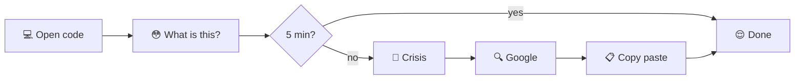

## Sentiment Analysis

- FinBert hugging face model - https://huggingface.co/ProsusAI/finbert
- Locally hosted backend on with fastApi
- Trading-bot with Alpaca: https://www.youtube.com/watch?v=c9OjEThuJjY&t=574s



### Test trading bot

- make a .env based on `.env.example`
- run `python tradingbot.py`
- should see /log dir with output of MLTrader along with 2 links comparing stock used with SPY

### Run the app locally with Uvicorn

uncomment the info in `requirements.txt`

#### using Uvicorn in terminal

`uvicorn app.main:app --reload`

#### OR do it from main.py

uncomment these lines

```
# if __name__ == "__main__":
# import uvicorn
# uvicorn.run(app, host="0.0.0.0", port=8000)
```

cd into `./app` then run `python main.py`

test with this command

`curl -X POST http://127.0.0.1:8000/analyze -H "Content-Type: application/json" -d '{"input": "responded negatively to the news!"}'`

### WARNING

```
C:\Users\19292\python\Lib\site-packages\transformers\tokenization_utils_base.py:1601: FutureWarning: `clean_up_tokenization_spaces` was not set. It will be set to `True` by default. This behavior will be depracted in transformers v4.45, and will be then set to `False` by default. For more details check this issue: https://github.com/huggingface/transformers/issues/31884
```

### Creating AWS lambda

- run `mkdir lambda_package` in terminal should be in root dir
- run `pip install -r requirements.txt -t lambda_package/`
- run `cp -r app/* lambda_package/` to copy the contents of your `app` directory into `lambda_package`
- `cd lambda_package` then `zip -r ../aws_lambda_artifact.zip .` \*if you dont have zip in git do it in your wsl terminal
- if file too big upload it to s3 and link it to lamda which is what i did
- file might still be too big should implement another api service ngl

## large file size lookup

`git rev-list --objects --all | grep -f <(git rev-list --objects --all | awk '{print $2}' | sort | uniq -d | awk '{print $1}')`
